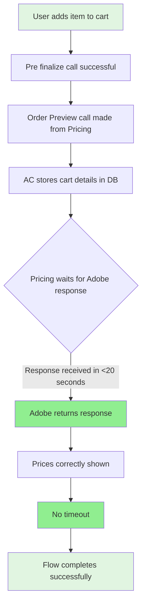
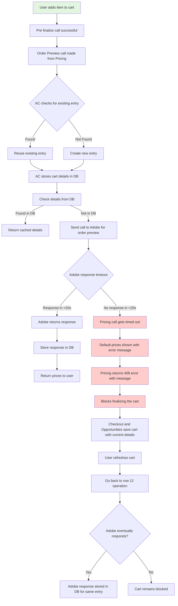
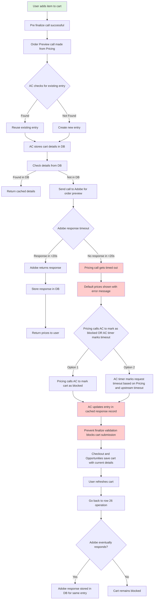
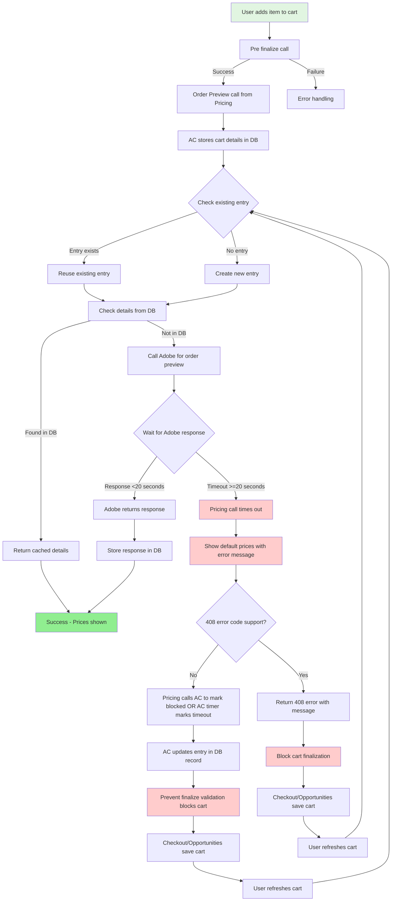

# Pricing & Cart Flow Diagram

This document describes the flow diagrams for the Pricing and Cart system, covering the happy path and timeout scenarios.

## 1. Happy Path Flow



## 2. Timeout Flow - With 408 Error Code Support



## 3. Timeout Flow - Without 408 Error Code Support



## 4. Combined Detailed Flow



## Data Flow - Pricing Request Details

When Pricing sends a request to Adobe Commerce (AC), it should include:

```
Request Payload:
├── Cart ID
├── Customer ID
└── SKUs with number of licenses
    ├── SKU 1: License count
    ├── SKU 2: License count
    └── ...
```

## Key Components

### Adobe Commerce (AC)
- Stores cart details in database
- Checks for existing entries based on Cart ID and items
- Caches Adobe responses
- Can mark requests as blocked/timed out

### Pricing Service
- Makes Order Preview calls to AC
- Handles timeout scenarios
- Returns 408 error code (if supported)
- Shows default prices on timeout
- Blocks cart finalization on timeout

### Adobe Service
- Provides order preview details
- Response time target: <20 seconds
- Response is cached by AC

### Checkout & Opportunities
- Save cart with current details
- Handle 408 errors (if supported)
- Prevent cart finalization when blocked

## Timeout Handling Mechanisms

### With 408 Error Support
1. Pricing returns 408 error code directly
2. Blocks cart finalization immediately
3. Checkout/Opportunities handle 408 error

### Without 408 Error Support
1. Pricing calls AC to mark cart as blocked, OR
2. AC uses timer based on Pricing and upstream timeout values
3. AC updates database entry to mark as blocked
4. Prevent finalize validation blocks cart submission

## Refresh Flow

When user refreshes the cart after timeout:
1. System checks database for cached response
2. If Adobe has responded in the meantime, response is available
3. If still no response, flow returns to timeout handling
4. Process repeats until Adobe responds or user cancels


